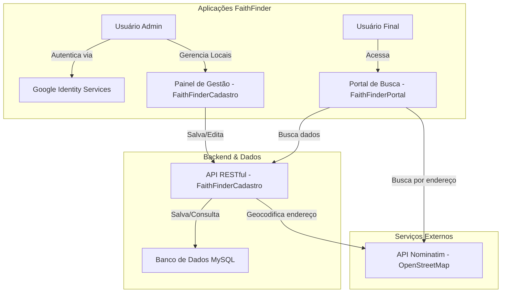

# Projeto FaithFinder - API de Gestão

## 1. Objetivo do Trabalho

Este projeto foi desenvolvido como parte da avaliação da disciplina de Técnicas de Integração de Sistemas. O objetivo principal é aplicar conhecimentos práticos na criação de uma API RESTful funcional que sirva como backend para a integração entre sistemas distintos.

A solução proposta atende a uma demanda social, criando uma plataforma centralizada para o cadastro e consulta de igrejas e eventos religiosos, com o intuito de fortalecer laços comunitários e facilitar o acesso da população a essas informações.

---

## 2. Descrição Funcional da Solução

A solução completa é composta por duas aplicações independentes (As duas estão contida no SRC):

1. **Aplicação 1: API de Gestão (FaithFinderCadastro)**
    * Um sistema de backend robusto construído com CodeIgniter 4.
    * Possui um painel administrativo protegido por login (Autenticação via Google) para a gestão completa (CRUD - Criar, Ler, Atualizar, Deletar) de locais (igrejas e eventos).
    * Ao cadastrar um novo local, o sistema se integra a uma API externa de geocodificação (Nominatim/OpenStreetMap) para converter o endereço em coordenadas geográficas (latitude e longitude), que são salvas no banco de dados.
    * Expõe uma API RESTful pública e documentada para que outras aplicações possam consumir os dados.

2. **Aplicação 2: Portal de Busca (FaithFinderBusca)**
    * Uma aplicação de frontend que consome os dados fornecidos por esta API.
    * Oferece uma interface pública onde usuários podem pesquisar por locais com base em termos de texto (nome, bairro, rua) ou por proximidade, ao fornecer um endereço.

---

## 3. Arquitetura da API e Diagrama

A API foi desenvolvida utilizando o framework CodeIgniter 4 em um ambiente de servidor PHP/MySQL (pilha LAMP/WAMP). A arquitetura segue o padrão MVC (Model-View-Controller) para a organização do painel de gestão e um padrão de Controller de Recursos para os endpoints da API.

Para uma descrição mais detalhada da interação entre os componentes e as aplicações, consulte o arquivo **[architecture.md](docs/architecture.md)**

### Diagrama de Fluxo Simplificado



## 4. Configuração do Projeto e Execução

Siga as instruções abaixo para configurar e executar a aplicação da API em um ambiente de desenvolvimento local.

#### Pré-requisitos

* XAMPP (ou similar) com Apache e MySQL ativos
* Composer
* Git

#### Passos para Instalação

1. **Clonar o Repositório:**

    ```bash
    git clone https://github.com/jailsoncruzz/ProjetoAPIIntegracaoSistemasFaithFinder.git FaithFinderCadastro
    ```

2. **Instalar Dependências:**
    Navegue até a pasta do projeto e instale as dependências do PHP com o Composer.

    ```bash
    cd src/FaithFinderCadastro
    composer install
    ```

    ```bash
    cd src/FaithFinderPortal
    composer install
    ```

3. **Configurar o Ambiente:**
    * Copie o arquivo `env` e renomeie a cópia para `.env`.
    * Abra o arquivo `.env` e configure o acesso ao seu banco de dados local:

        ```env
        database.default.hostname = localhost
        database.default.database = faithfinder
        database.default.username = root
        database.default.password =
        ```

    * Configure a `baseURL` no arquivo `app/Config/App.php` para corresponder à sua estrutura de pastas no XAMPP:

        ```php
        public string $baseURL = 'http://localhost/FaithFinderCadastro/';
        ```

4. **Criar Banco e as Tabelas do Banco:**
    Vá até o phpmyadmin e crie um novo banco:faithfinder. Execute o comando de migration para criar todas as tabelas e colunas necessárias automaticamente.

    ```bash
    php spark migrate
    ```

5. **Executar a Aplicação:**
    * Acesse o painel de gestão através do seu servidor XAMPP no endereço: `http://localhost/FaithFinderCadastro/public/`
    * (Opcional) Você pode usar o servidor de desenvolvimento do CodeIgniter, que é mais simples para testes:

        ```bash
        php spark serve
        ```

    * Neste caso, a aplicação estará disponível em `http://localhost:8080`.

---

### 5. Documentação e Execução via Postman

Para testar os endpoints da API, utilize uma ferramenta como Postman ou Insomnia.

#### Execução

1. Importe a coleção de testes que está no arquivo `/postman/collection.json` deste projeto.
2. A coleção já terá os endpoints principais pré-configurados.
3. Selecione uma requisição, como **"Listar Locais por Texto"**.
4. Na aba "Params", altere o valor do parâmetro `q` para o termo que deseja buscar.
5. Clique em "Send" e observe a resposta em JSON no painel inferior.

### Documentação das Rotas da API

Esta seção detalha os endpoints da API interna do FaithFinder, bem como as APIs externas consumidas pelo projeto.

#### API Interna (`FaithFinderCadastro`)

##### `GET /api/locais`

[cite_start]Retorna uma lista de locais (igrejas ou eventos) com base em filtros de busca[cite: 17].

* **Método:** `GET`
* **Endpoint:** `/api/locais`
* **Parâmetros de Query (Opcionais):**

| Parâmetro | Tipo   | Descrição                                                                                                                                              |
| :-------- | :----- | :----------------------------------------------------------------------------------------------------------------------------------------------------- |
| `q`       | string | Termo de busca textual. A API procurará por qualquer palavra deste termo nos campos `nome`, `descricao`, `bairro`, `cidade`, `rua`, `numero` e `estado`. |
| `lat`     | float  | Latitude do ponto central da busca por proximidade. **Deve ser usado em conjunto com `lon`.** |
| `lon`     | float  | Longitude do ponto central da busca por proximidade. **Deve ser usado em conjunto com `lat`.** |

* **Exemplo de Requisição (Busca textual):**
    ```
    GET http://localhost/FaithFinderCadastro/public/api/locais?q=Igreja+Centro
    ```

* **Exemplo de Requisição (Busca por proximidade):**
    ```
    GET http://localhost/FaithFinderCadastro/public/api/locais?lat=-3.7298&lon=-38.6602
    ```

* **Resposta de Sucesso (200 OK):**
    ```json
    [
        {
            "id": "4",
            "fk_user_id": "1",
            "tipo": "igreja",
            "nome": "Igreja do Centro",
            "descricao": "Paróquia principal da cidade",
            "latitude": "-3.73186210",
            "longitude": "-38.52341900",
            "distance": 1.253
        }
    ]
    ```
    *(Nota: o campo `distance` só aparece em buscas por proximidade.)*

---

##### `GET /api/locais/{id}`

Retorna os detalhes de um local específico.

* **Método:** `GET`
* **Endpoint:** `/api/locais/{id}`
* **Parâmetros de URL:**

| Parâmetro | Tipo    | Descrição                                        |
| :-------- | :------ | :------------------------------------------------- |
| `{id}`    | integer | O ID único do local a ser retornado. **(Obrigatório)** |

* **Exemplo de Requisição:**
    ```
    GET http://localhost/FaithFinderCadastro/public/api/locais/4
    ```

* **Resposta de Sucesso (200 OK):**
    ```json
    {
        "id": "4",
        "fk_user_id": "1",
        "tipo": "igreja",
        "nome": "Igreja do Centro",
        "descricao": "Paróquia principal da cidade",
        "data_referencia": null,
        "cep": "60000-000",
        "estado": "CE",
        "cidade": "Fortaleza",
        "bairro": "Centro",
        "rua": "Rua Principal",
        "numero": "123",
        "complemento": null,
        "latitude": "-3.73186210",
        "longitude": "-38.52341900",
        "created_at": "2025-09-29 20:51:40",
        "updated_at": "2025-09-29 20:51:40",
        "deleted_at": null
    }
    ```

* **Resposta de Erro (404 Not Found):**
    ```json
    {
        "status": 404,
        "error": 404,
        "messages": {
            "error": "Local não encontrado"
        }
    }
    ```
---

#### APIs Externas Utilizadas

##### API de Geolocalização: Nominatim (OpenStreetMap)

Utilizada para converter endereços textuais em coordenadas geográficas (latitude e longitude).

* **Método:** `GET`
* **Endpoint:** `https://nominatim.openstreetmap.org/search`
* **Parâmetros de Query Principais:**

| Parâmetro | Tipo   | Descrição                                                      |
| :-------- | :----- | :--------------------------------------------------------------- |
| `q`       | string | O endereço a ser pesquisado (ex: "Rua X, Cidade Y, Estado Z"). |
| `format`  | string | O formato da resposta desejado. Usamos `json`.                 |

* **Exemplo de Requisição:**
    ```
    GET [https://nominatim.openstreetmap.org/search?q=Avenida+da+Universidade,Fortaleza,CE&format=json&limit=1](https://nominatim.openstreetmap.org/search?q=Avenida+da+Universidade,Fortaleza,CE&format=json&limit=1)
    ```

* **Exemplo de Resposta de Sucesso (200 OK):**
    ```json
    [
        {
            "place_id": 12345,
            "licence": "Data © OpenStreetMap contributors, ODbL 1.0. [http://osm.org/copyright](http://osm.org/copyright)",
            "osm_type": "way",
            "osm_id": 67890,
            "lat": "-3.74025",
            "lon": "-38.5361",
            "display_name": "Avenida da Universidade, Benfica, Fortaleza, Ceará, Brasil",
            "class": "highway",
            "type": "primary",
            "importance": 0.6
        }
    ]
    ```
---
##### API de Autenticação: Google Identity Services

Utilizada para autenticar os usuários no painel de gestão (`FaithFinderCadastro`) e personalizar a experiência no portal de busca.

* **Protocolo:** OAuth 2.0 / OpenID Connect (OIDC).
* **Componente Principal:** **Token JWT (JSON Web Token)**.
* **Descrição do Fluxo:**
    1.  A aplicação carrega a biblioteca JavaScript do Google.
    2.  O usuário clica no botão "Sign in with Google" e autoriza o acesso.
    3.  O servidor do Google retorna um Token JWT para o frontend da aplicação.
    4.  Este token, que é uma string codificada (ex: `eyJhbGciOi...`), contém as informações do usuário de forma segura.
    5.  A aplicação backend (`FaithFinderCadastro`) recebe este token, valida sua autenticidade com os servidores do Google e, se válido, cria uma sessão de login para o usuário.

### Papéis e Responsabilidades da Equipe

A equipe foi organizada com as seguintes atribuições para o desenvolvimento do projeto:

* **Francisco Jailson da Cruz Santos** (Matrícula: 2326152)
  * **Responsabilidade:** Desenvolvimento back-end da API em PHP com o framework CodeIgniter 4, incluindo a lógica de negócio, integração com o banco de dados e com as APIs externas.

* **Pedro Sahel Queiroz Freire**
  * **Responsabilidade:** Desenvolvimento front-end do painel de gestão e do portal de busca, utilizando HTML, CSS, JavaScript e o framework Bootstrap para garantir a responsividade e a experiência do usuário.

* **João Paulo Silva Dutra** (Matrícula: 2319290)
  * **Responsabilidade:** Elaboração da documentação geral do projeto, incluindo a descrição funcional, o objetivo e as instruções de configuração e uso no `README.md`.

* **Maria Livia Teixeira Lima** (Matrícula: 2323843)
  * **Responsabilidade:** Elaboração da documentação técnica da arquitetura no arquivo `architecture.md` e auxílio na documentação geral e de rotas da API.

* **Larissa Evelyn** (Matrícula: 2326247)
  * **Responsabilidade:** Estruturação e manutenção do repositório no GitHub, criação dos arquivos markdown e garantia de que o projeto segue a estrutura de pastas exigida na documentação.
